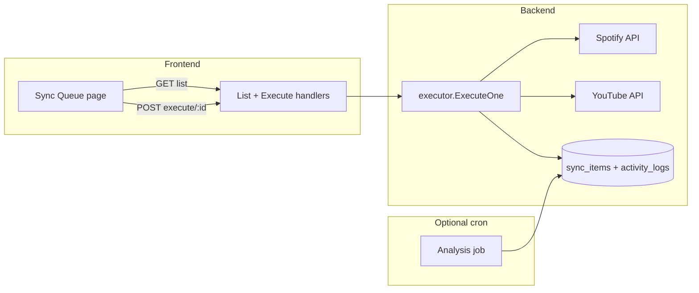

# Executor V1 — Manual Sync Items (Patch Plan)

**Status:** Implemented (backend + Sync Queue UI with Execute, View detail, executor logs in modal)  
**Depends on:** RFC-007 (analysis / `sync_items`), RFC-008 (executor design), PR #4 OAuth + mappings baseline  
**Replaces (for V1):** Automatic executor cron from RFC-008 §3.2

---

## 1. Problem / intent

Today:

- **Analysis** can run on a cron (when `SYNC_WORKERS_ENABLED=true`) and writes `sync_items` + `activity_logs`.
- **Executor** code from RFC-008 was never ported to the Echo stack; scheduler only logs a stub when `SYNC_EXECUTOR_AUTO_ENABLED=true`.
- **Activity logs** stay empty until analysis runs; nothing applies queue items to Spotify/YouTube.
- Only **GET** `/api/collections/sync_items/records/:id` exists (detail for logs modal).

**V1 goal:** Operator-driven execution — list queue items, filter, run **one item at a time**, see result + logs. No background executor loop until the manual path is trustworthy.

---

## 2. Spec alignment (RFC-008)

RFC-008 assumed:

| Step | Design |
|------|--------|
| Dequeue | `status=pending` AND `next_attempt_at <= now`, batch 50, order by `created` |
| Dispatch | By `service` + `operation` (`add`, `rename`, `remove` later) |
| Spotify add | Add track to mapped playlist |
| YouTube add | `playlistItems.insert` |
| Rename | Update playlist title on target service |
| Success | `status=done`, bump `attempt_count` |
| 429 | Stay `pending`, exponential backoff on `next_attempt_at` |
| Other errors | `status=error`, `error_message` (≤512 chars) |
| Idempotency | 400/409 “already exists” → treat as `done` |

**Echo schema today:** `operation` in DB (`add` / `remove` / `rename`), not `action`. No `next_attempt_at` column yet (RFC-008 migration not applied). V1 can use `last_attempt_at` + `attempt_count` only.

**V1 deviation:** No cron executor; trigger via **POST execute** per id. Keep `SYNC_EXECUTOR_AUTO_ENABLED=false` default.

---

## 3. Architecture (V1)



---

## 4. Backend patches

### 4.1 `internal/jobs/executor.go` (new)

Extract from RFC-008 design:

- `ExecuteOne(ctx, itemID string) (SyncItemResponse, error)`
- Load item + parent mapping (playlist IDs, names)
- `switch operation + service`:
  - `youtube` + `add` → search/find video, insert into YouTube playlist
  - `spotify` + `add` → search track, add to Spotify playlist
  - `youtube` + `rename` → update playlist title (`TrackTitle` holds target name)
  - `spotify` + `rename` → update Spotify playlist name
- Update row: `status`, `error_message`, `attempt_count`, `last_attempt_at`, `updated`
- `activityLogger.RecordInfo/RecordError(..., job_type="executor")`

Reuse `auth.ClientFactory` (same as analysis).

### 4.2 HTTP routes

Extend group `/api/collections/sync_items/records`:

| Method | Path | Purpose |
|--------|------|---------|
| GET | `` | Paginated list + filters |
| GET | `/:id` | Detail (exists) |
| POST | `/:id/execute` | Run executor for one item |

**List query params:** `page`, `per_page`, `status`, `service`, `operation`, `mapping_id`, `sort` (`created`), `order` (`asc`/`desc`).

**Execute response:** Updated `SyncItemResponse` + optional `execution_log` string (last API error summary).

### 4.3 Source / destination (no new DB columns for V1)

**What we already persist:**

| Field | Meaning today |
|-------|----------------|
| `service` | **Destination** — platform where the executor applies the change (`spotify` or `youtube`). |
| `operation` | `add` (track) or `rename` (playlist title). |
| `track_id`, `track_title`, `track_artist` | The track (for `add`) or target title (for `rename` on YouTube). |
| `mapping_id` | Links to both playlists via `mappings` row. |

**What we do not persist:** explicit `source_service` / `destination_service` columns.

**V1 recommendation (no migration):** Enrich list/detail JSON in the handler by joining `mappings` and **deriving** source/destination for the UI:

| `operation` | `service` (dest) | Derived source | Derived destination | Row label example |
|-------------|------------------|----------------|---------------------|-------------------|
| `add` | `youtube` | `spotify` | `youtube` | Add “Song A” → YouTube (from Spotify) |
| `add` | `spotify` | `youtube` | `spotify` | Add “Video X” → Spotify (from YouTube) |
| `rename` | `youtube` | `spotify` (canonical title) | `youtube` | Rename YouTube playlist → Spotify title |

Optional response fields:

```json
{
  "service": "youtube",
  "source_service": "spotify",
  "destination_service": "youtube",
  "source_playlist_name": "My Spotify Playlist",
  "destination_playlist_name": "My YouTube Playlist"
}
```

Playlist names come from the mapping join (`spotify_playlist_name`, `youtube_playlist_name`) — already in DB.

**If we later want persisted source:** add columns in a follow-up migration only if derivation proves insufficient (e.g. multi-step flows). **Do not expand scope in V1** unless product requires audit trail of analysis-time source snapshot.

### 4.4 Scheduler

- Already: `SYNC_EXECUTOR_AUTO_ENABLED=false` by default.
- V1: Do not register auto cron unless explicitly enabled.
- Manual path does not require workers flag; execute endpoint only needs OAuth tokens + DB.

### 4.5 Migrations (optional in V1.1)

Add RFC-008 fields if we want auto-retry later:

- `next_attempt_at`
- `attempt_backoff_secs`

Not required for manual single-shot execute.

### 4.6 Tests

- **Backend unit:** `ExecuteOne` per operation with httpmock (Spotify/YouTube)
- **Backend handler:** list pagination + filters; execute 404 when not found; 409 when status not executable
- **Backend integration:** insert pending item → POST execute → status `done` or `error`

---

## 5. Frontend patches

### 5.1 Route

- `/sync-queue` (nav: “Sync Queue”, near Mappings / advanced Logs)
- TanStack Table + existing pagination patterns from mappings/logs

### 5.2 Columns

| Column | Source |
|--------|--------|
| Status | `status` badge |
| Operation | `operation` |
| Source → Dest | `source_service` → `destination_service` (derived in API; see §4.3) |
| Playlists | `source_playlist_name` / `destination_playlist_name` (from mapping join) |
| Track / target | `track_title` / `track_artist` (or rename target in `track_title`) |
| Mapping | `mapping_id` (link to mapping edit) |
| Attempts | `attempt_count` |
| Updated | `updated` |
| Actions | **Execute** (if executable), **View** detail |

### 5.3 Filters

- Status (multi or single)
- Service (destination)
- Operation
- Mapping ID

### 5.4 Execute UX

- Button → `POST .../execute` → loading state on row
- Toast or inline alert: success / error + `error_message`
- Invalidate list query + optional drawer showing last `activity_logs` for `job_type=executor` + `mapping_id`

### 5.5 API client

- `syncItemsAPI.list(params)`
- `syncItemsAPI.execute(id)`

### 5.6 Frontend tests (Vitest + MSW — not Playwright)

Align with existing Spotube testing style (`handlers.ts`, component tests with `mswServer`):

| Test | Tooling |
|------|---------|
| Sync Queue table renders rows | Vitest + RTL + MSW list fixture |
| Execute button calls POST and updates row state | Vitest + MSW handler override |
| Execute disabled for `done` / `skipped` | Vitest |
| Source → Dest columns show derived labels | Vitest + fixture with `source_service` / `destination_service` |
| API client `execute` error mapping | Vitest (`client.test.ts` pattern) |

**Manual pass (non-automated):** real OAuth + one execute against Spotify/YouTube in local dev — documented in test plan checklist, not a Playwright suite.

**Explicitly out of scope for V1 automated tests:** Playwright E2E for sync queue (defer until manual path is stable).

---

## 6. Validation checklist

1. Enable `SYNC_WORKERS_ENABLED=true`, wait for analysis → pending items.
2. Open Sync Queue → see rows with **Source → Dest** and playlist names.
3. Execute one `add` item → row → `done`, activity log entry.
4. Execute `rename` item → verify title in provider UI (manual).
5. Run `make frontend/test` — Vitest + MSW coverage for queue page and execute flow.

---

## 7. Phased delivery

| PR slice | Scope |
|----------|--------|
| **A** | `executor.go` + POST execute + backend tests |
| **B** | GET list (with derived source/dest + mapping names) + handler tests |
| **C** | Sync Queue page + API wiring + Vitest/MSW tests |
| **D** | Docs update (RFC-101, this handoff) + manual OAuth checklist |

---

## 8. Open decisions (with recommendations)

### 1. Search strategy for `add`

**Recommendation:**

- **Spotify destination:** YouTube Data API `search.list` with `q="{track_title} {track_artist}"`, type `video`, pick first reasonable result; store video ID used in activity log.
- **YouTube destination:** Spotify Web API search (`SearchTracks`) with `track_title` + `track_artist`, pick top match; add by Spotify URI to mapped playlist.
- **Fallback:** If search returns empty, mark `error` with clear message (`"no match on {service}"`); do not auto-blacklist on first failure in V1 manual mode (operator decides retry).

### 2. Re-execute

**Recommendation:** Allow POST execute when `status` is `pending` or `error` only. Reject `done` and `skipped` with 409 unless we add an explicit `?force=true` query later. Manual debugging can delete/recreate items or reset status in DB for now.

### 3. Running state

**Recommendation:** Yes — set `status=running` at start of execute, clear to `done`/`error` at end. Prevents double-click and makes UI show in-progress. Use a DB row lock or `UPDATE ... WHERE status IN ('pending','error')` so only one execute wins.

### 4. Blacklist check before execute

**Recommendation:** Yes for V1 — before calling external APIs, if `(mapping_id, service, track_id)` exists in `blacklist`, return 409 with message `"track blacklisted"` and set item `skipped` (or leave `pending` with error; prefer **`skipped`** to match RFC). See §10. Do **not** auto-insert blacklist on manual execute failure in V1; only skip existing entries. Auto-blacklist stays a later executor-cron feature.

---

## 9. Confirmed: `sync_name` = playlist title

- Mapping field `sync_name` (UI: “Sync playlist name”).
- Analysis compares `spotify_playlist_name` vs `youtube_playlist_name`.
- Enqueues `operation=rename` on **YouTube** with `track_title` = target Spotify playlist name.
- **Not** used for track/song titles; track sync is `sync_tracks` only.

---

## 10. What the `blacklist` table is for

Per mapping, per **destination service**, per **track_id**:

| Purpose | Behavior |
|---------|----------|
| **Stop retrying hopeless tracks** | Tracks that failed fatally (not found, region-locked, wrong type) get a blacklist row so analysis/executor do not keep queueing the same failing work. |
| **Scope** | `(mapping_id, service, track_id)` unique — one mapping’s YouTube blacklist does not affect another mapping. |
| **Fields** | `reason` (why skipped), `skip_counter`, `last_skipped_at` for UI on `/mappings/:id/blacklist`. |
| **RFC-008 design** | Executor adds blacklist on fatal errors; analysis **filters out** blacklisted tracks before creating new sync items. |
| **Echo today** | CRUD API + UI exist (`/api/collections/blacklist/records`, mapping blacklist page). Analysis job does **not** yet filter blacklist when generating items; executor does **not** auto-add yet. V1 manual execute should **read** blacklist before running (§8.4). |

**Mental model:** blacklist = “do not try to sync this track on this service for this mapping until the user removes it.”

---

*End of patch plan*
