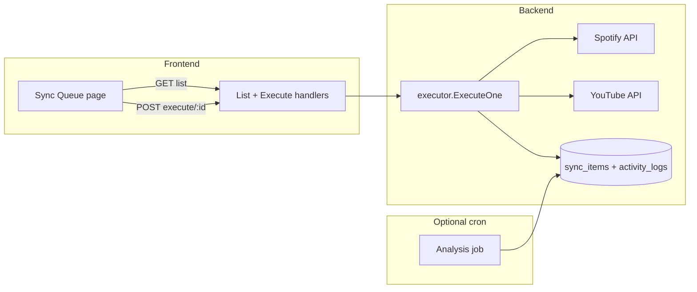

# Executor V1 — Manual Sync Items (Patch Plan)

**Status:** Proposed  
**Depends on:** RFC-007 (analysis / `sync_items`), RFC-008 (executor design), PR #4 OAuth + mappings baseline  
**Replaces (for V1):** Automatic executor cron from RFC-008 §3.2

---

## 1. Problem / intent

Today:

- **Analysis** can run on a cron (when `SYNC_WORKERS_ENABLED=true`) and writes `sync_items` + `activity_logs`.
- **Executor** code from RFC-008 was never ported to the Echo stack; scheduler only logs a stub when `SYNC_EXECUTOR_AUTO_ENABLED=true`.
- **Activity logs** stay empty until analysis runs; nothing applies queue items to Spotify/YouTube.
- Only **GET** `/api/collections/sync_items/records/:id` exists (detail for logs modal).

**V1 goal:** Operator-driven execution — list queue items, filter, run **one item at a time**, see result + logs. No background executor loop until the manual path is trustworthy.

---

## 2. Spec alignment (RFC-008)

RFC-008 assumed:

| Step         | Design                                                                      |
| ------------ | --------------------------------------------------------------------------- |
| Dequeue      | `status=pending` AND `next_attempt_at <= now`, batch 50, order by `created` |
| Dispatch     | By `service` + `operation` (`add`, `rename`, `remove` later)                |
| Spotify add  | Add track to mapped playlist                                                |
| YouTube add  | `playlistItems.insert`                                                      |
| Rename       | Update playlist title on target service                                     |
| Success      | `status=done`, bump `attempt_count`                                         |
| 429          | Stay `pending`, exponential backoff on `next_attempt_at`                    |
| Other errors | `status=error`, `error_message` (≤512 chars)                                |
| Idempotency  | 400/409 “already exists” → treat as `done`                                  |

**Echo schema today:** `operation` in DB (`add` / `remove` / `rename`), not `action`. No `next_attempt_at` column yet (RFC-008 migration not applied). V1 can use `last_attempt_at` + `attempt_count` only.

**V1 deviation:** No cron executor; trigger via **POST execute** per id. Keep `SYNC_EXECUTOR_AUTO_ENABLED=false` default.

---

## 3. Architecture (V1)

---

## 4. Backend patches

### 4.1 `internal/jobs/executor.go` (new)

Extract from RFC-008 design:

- `ExecuteOne(ctx, itemID string) (SyncItemResponse, error)`
- Load item + parent mapping (playlist IDs, names)
- `switch operation + service`:
  - `youtube` + `add` → search/find video, insert into YouTube playlist
  - `spotify` + `add` → search track, add to Spotify playlist
  - `youtube` + `rename` → update playlist title (`TrackTitle` holds target name)
  - `spotify` + `rename` → update Spotify playlist name
- Update row: `status`, `error_message`, `attempt_count`, `last_attempt_at`, `updated`
- `activityLogger.RecordInfo/RecordError(..., job_type="executor")`

Reuse `auth.ClientFactory` (same as analysis).

### 4.2 HTTP routes

Extend group `/api/collections/sync_items/records`:

| Method | Path           | Purpose                   |
| ------ | -------------- | ------------------------- |
| GET    | ``             | Paginated list + filters  |
| GET    | `/:id`         | Detail (exists)           |
| POST   | `/:id/execute` | Run executor for one item |

**List query params:** `page`, `per_page`, `status`, `service`, `operation`, `mapping_id`, `sort` (`created`), `order` (`asc`/`desc`).

**Execute response:** Updated `SyncItemResponse` + optional `execution_log` string (last API error summary).

### 4.3 Scheduler

- Already: `SYNC_EXECUTOR_AUTO_ENABLED=false` by default.
- V1: Do not register auto cron unless explicitly enabled.
- Manual path does not require workers flag; execute endpoint only needs OAuth tokens + DB.

### 4.4 Migrations (optional in V1.1)

Add RFC-008 fields if we want auto-retry later:

- `next_attempt_at`
- `attempt_backoff_secs`

Not required for manual single-shot execute.

### 4.5 Tests

- Unit: `ExecuteOne` per operation with httpmock (Spotify/YouTube)
- Handler: list pagination + filters; execute 404/409 when not `pending`
- Integration: insert pending item → POST execute → status `done` or `error`

---

## 5. Frontend patches

### 5.1 Route

- `/sync-queue` (nav: “Sync Queue”, near Mappings / advanced Logs)
- TanStack Table + existing pagination patterns from mappings/logs

### 5.2 Columns

| Column    | Source                                                 |
| --------- | ------------------------------------------------------ |
| Status    | `status` badge                                         |
| Operation | `operation`                                            |
| Service   | `service`                                              |
| Track     | `track_title` / `track_artist`                         |
| Mapping   | `mapping_id` (link to mapping edit)                    |
| Attempts  | `attempt_count`                                        |
| Updated   | `updated`                                              |
| Actions   | **Execute** (if `pending` or `error`), **View** detail |

### 5.3 Filters

- Status (multi or single)
- Service
- Operation
- Mapping ID

### 5.4 Execute UX

- Button → `POST .../execute` → loading state on row
- Toast or inline alert: success / error + `error_message`
- Invalidate list query + optional drawer showing last `activity_logs` for `job_type=executor` + `mapping_id`

### 5.5 API client

- `syncItemsAPI.list(params)`
- `syncItemsAPI.execute(id)`

---

## 6. E2E / browser validation

1. Enable `SYNC_WORKERS_ENABLED=true`, wait for analysis → pending items.
2. Open Sync Queue → see rows.
3. Execute one `add` item → row → `done`, activity log entry.
4. Execute `rename` item → YouTube/Spotify title updates (manual verify in provider UI).
5. Playwright: mock execute API; smoke test table render + button disabled when `done`.

Use browser tools on `localhost:5173/sync-queue` after implementation.

---

## 7. Phased delivery

| PR slice | Scope                                |
| -------- | ------------------------------------ |
| **A**    | `executor.go` + POST execute + tests |
| **B**    | GET list + filters + tests           |
| **C**    | Sync Queue page + API wiring         |
| **D**    | E2E + docs update RFC-101            |

---

## 8. Open decisions

1. **Search strategy for `add`:** YouTube search by `track_title` + `track_artist`? Spotify search API?
2. **Re-execute:** Allow POST on `error` only, or also `done` (force)?
3. **Running state:** Set `status=running` during execute to prevent double-click?
4. **Blacklist:** Check `blacklist` table before execute (RFC-008 §3.3)?

---

## 9. Confirmed: `sync_name` = playlist title

- Mapping field `sync_name` (UI: “Sync playlist name”).
- Analysis compares `spotify_playlist_name` vs `youtube_playlist_name`.
- Enqueues `operation=rename` on **YouTube** with `track_title` = target Spotify playlist name.
- **Not** used for track/song titles; track sync is `sync_tracks` only.

---

*End of patch plan*