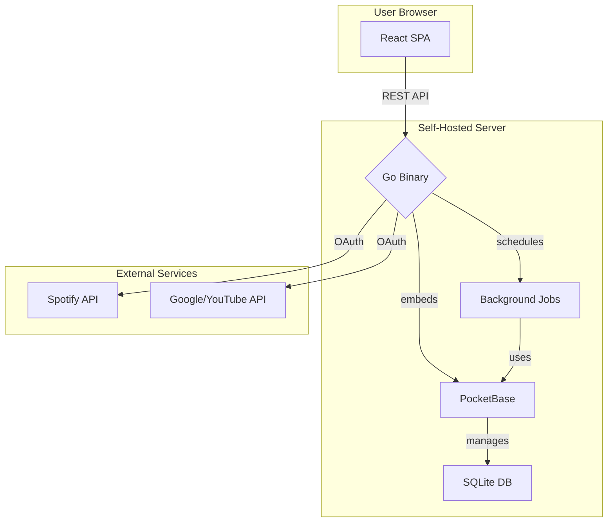

# RFC-013: Documentation & README

**Status:** Draft  
**Branch:** `rfc/013-documentation`  
**Depends On:** All previous RFCs, as it documents the final state of the MVP.

---

## 1. Goal

Create a comprehensive, high-quality `README.md` for the project root that serves as an excellent starting point for new developers, contributors, and self-hosted users. This includes a project overview, technical stack, architecture diagram, and clear setup/usage instructions.

## 2. Background & Context

A good README is the front door to a project. With the core features of the MVP now defined through RFCs, we can create a complete document that accurately reflects the project's architecture, dependencies, and development workflow. This replaces any boilerplate or placeholder content.

## 3. Technical Design

The new `README.md` will be structured into the following sections.

### 3.1 Project Title & Overview
*   **Title**: YouTube ⇆ Spotify Playlist Sync
*   **Badges**: (Optional) Add shields.io badges for Go version, license, etc.
*   **Description**: A concise summary of the application's purpose, based on the PRD's introduction.

### 3.2 Architecture Diagram
A Mermaid.js diagram embedded directly in the README to visualize the system components.


### 3.3 Technical Stack
A clear, bulleted list of the key technologies used, taken directly from the PRD.
*   **Backend**: Go, PocketBase, Zerolog
*   **Frontend**: React 19, Vite, TypeScript, Tailwind CSS, TanStack Stack
*   **Database**: SQLite
*   **Build & Dev**: Docker, Make, Air (live-reload)

### 3.4 Getting Started

#### Prerequisites
*   Go (version from `go.mod`)
*   Node.js (version from `.nvmrc`)
*   Docker & Docker Compose (for running, optional)
*   `make` utility
*   `air` for live-reloading (`go install github.com/air-verse/air@latest`)

#### Installation & Setup
1.  Clone the repository.
2.  Copy `.env.example` to `.env` and fill in the required values (or explain that the wizard will handle this).
3.  Run `make dev` to start the development servers.
4.  Navigate to `http://localhost:5173` (Vite dev server).
5.  The first run will trigger the Setup Wizard if credentials are not in `.env`.

### 3.5 Development Workflow
A summary of the most common `make` commands.
*   `make dev`: Starts concurrent backend (with Air) and frontend (with Vite) dev servers.
*   `make test`: Runs all backend and frontend tests.
*   `make lint`: Runs all backend and frontend linters, including TypeScript type checking.
*   `make build-image`: Builds the final production Docker image.

### 3.6 Deployment
A brief overview of the production deployment strategy.
*   The application is packaged as a single Docker container.
*   It serves the API and frontend on a single port (default `8090`).
*   Configuration is managed via environment variables.
*   Persistent data (SQLite DB) should be mounted to a volume at `/app/pb_data`.
*   Provide a sample `docker-compose.yml` for easy deployment.

```yaml
version: '3.8'
services:
  spotube:
    image: your-repo/spotube:latest # Replace with your image name
    container_name: spotube
    restart: unless-stopped
    ports:
      - "8090:8090"
    volumes:
      - ./data:/app/pb_data
    environment:
      - SPOTIFY_ID=${SPOTIFY_ID}
      - SPOTIFY_SECRET=${SPOTIFY_SECRET}
      - GOOGLE_CLIENT_ID=${GOOGLE_CLIENT_ID}
      - GOOGLE_CLIENT_SECRET=${GOOGLE_CLIENT_SECRET}
      # - TZ=America/New_York
```

### 3.7 Contributing
A brief section linking to the `agent_guide_and_templates.md` and explaining the RFC-driven process.

## 4. Dependencies
*   None required for this RFC, as it is purely documentation.

## 5. Checklist
- [ ] **DOC1** Draft the new `README.md` content in a separate file.
- [ ] **DOC2** Create the Mermaid.js architecture diagram.
- [ ] **DOC3** Write the "Getting Started" and "Development Workflow" sections.
- [ ] **DOC4** Write the "Deployment" section and include a sample `docker-compose.yml`.
- [ ] **DOC5** Replace the content of the root `README.md` with the new, comprehensive version.
- [ ] **DOC6** Review all links and commands in the new README for accuracy.

## 6. Definition of Done
*   The root `README.md` is replaced with a high-quality, comprehensive document.
*   A new developer or user can successfully clone, set up, and run the project using only the README instructions.
*   The architecture and development process are clearly explained.

## Resources & References
*   Mermaid.js Syntax – https://mermaid.js.org/syntax/graph.html
*   Shields.io (for badges) – https://shields.io/
*   Docker Compose File Reference – https://docs.docker.com/compose/compose-file/

---

*End of RFC-013* 